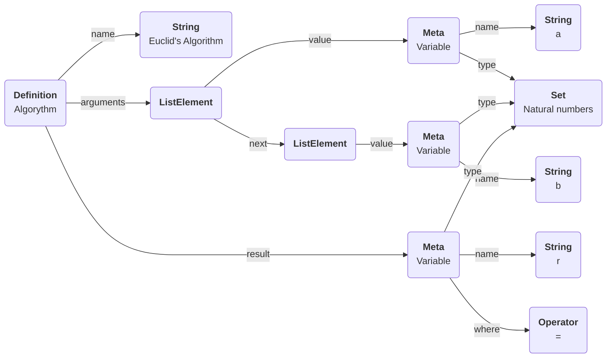

```haskell
(%) = RemainderOperation a b
	where
		if r = a % b then
			r in N and
			0 <= r < b and
			E k in N => a = k * b + r
```


> Euqlid's Algorithm
> **Arguments**:
> `a, b : T`
> **Uses**:
> `T`
> `(|) : DIVISABILITY(T)`
> `(=) : EQUALITY(T)`
> `(%) : MODULO(T)`
> **Result**:
> `r :T = max{r : a|r and b|r}`
> **Implementation**:
> ...