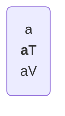
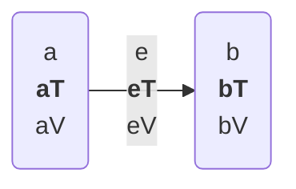

**PROBLEM**(pattern matching query structure):
One of the most useful and powerful programming techniques is `pattern matching`.
It is simple in cases of finite lists of options. A bit more involved in cases of finite lists of options with parameters (like in case of Haskell or Rust).
But it is much harder to do in case of a general directed graph.
We need to differentiate between a lot of parts and their combinations while making it efficient enough to work in real time.
Individually the things that we need to differentiate:

Lets say we have a query language where query for a not of type `aT` with a value `aV` looks like (we label the result as `a`, this label is not part of the node itself but just the query):

And a query for 2 nodes connected by an edge `e` of type `eT` and value `eV` would look like:

As a wild flag we can use `?`

Lets say we have a query like 
